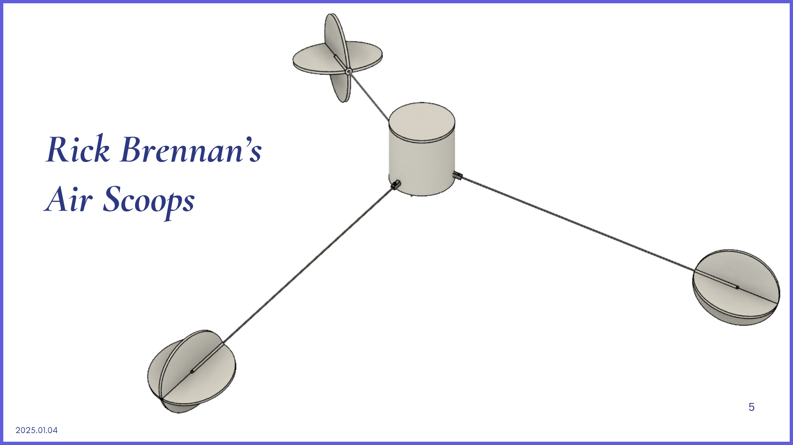

# Structural-Payload-and-Thermal-Subsystem

Explore the engineering that keeps our high-altitude missions airborne. As part of the Structural Group, you’ll dive into lightweight, high-strength design — where material and mechanical science meets atmospheric extremes.

---

## 🌐 What We Do

In the Structural, Payload and Thermal Subsystem, you’ll be responsible for:

- Designing and fabricating the weather balloon’s payload enclosure  
- Selecting and integrating environmental sensors (temperature, pressure, humidity)  
- Ensuring thermal insulation and structural stability at 30+ km altitudes  
- Implementing passive stabilization mechanisms for better camera footage  
- Optimizing mass-to-strength ratio for long-duration flights  
- Testing for vibration, thermal stress, and impact resistance  

> The stratosphere is cold, windy, and unforgiving — and we build to survive it.

---

## 🔧 Technologies & Tools You’ll Work With

- 🛠️ CAD modeling (SolidWorks, Fusion360) and 3D printing  
- 🔥 Thermal insulation techniques and materials  
- 🧪 Environmental and structural simulation (e.g., FEA in SolidWorks/ANSYS)  
- 📦 Modular designs for secure sensor housing and parachute deployment  

---

## 🧗 Why Join?

This subsystem is ideal if you love:

- Building and designing real hardware for extreme environments  
- Exploring the entire design-to-manufacturing process and assembly  
- Gain hands-on skills in electronics integration and enclosure prototyping

  
   
  <em>Figure 1: Simple block diagram of the subsystem</em>

  
   
  <em>Figure 2: Proposed passive stabilizer mechanism</em>

